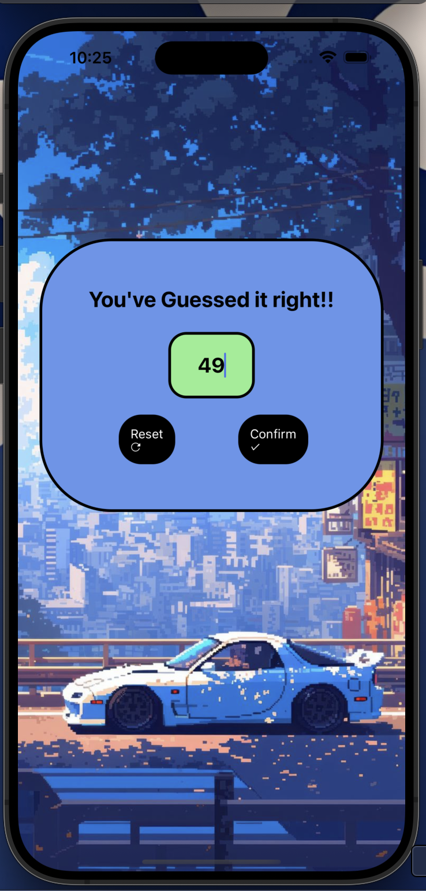

# 🎮 Guess the Number - React Native App

This is a simple number-guessing game built using **React Native**. The user has to guess the correct number between 1 and 99. If the guess is right, a success message is displayed. Otherwise, the user is prompted to try again.

---

## 📱 Screenshot



---

## 🚀 Features

- User-friendly interface
- Random number generated on each reset
- Input validation
- Clean and colorful UI with background image
- Fun and minimal game logic

---

## 🛠️ Technologies Used

- React Native
- Expo
- JavaScript
- Ionicons & AntDesign for icons

---

## ▶️ How to Run

1. Clone the repository:

```bash
git clone https://github.com/diwakar7sharma/MultiScreen.git
